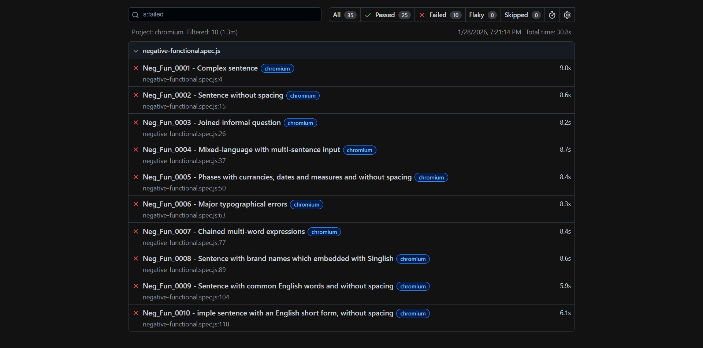

# Singlish → Sinhala Translator Testing (Playwright)

This repository contains automated functional and UI tests for the Singlish-to-Sinhala transliteration system available at:

https://www.swifttranslator.com/

The objective of this project is to assess:
- Accuracy of Singlish to Sinhala conversion
- Robustness under different input conditions
- UI behavior such as real-time output updating and input handling

This project was developed as part of an academic testing assignment using Playwright.

---

## Tools & Technologies
- Node.js
- Playwright Test
- Visual Studio Code
- GitHub

---

## Prerequisites
- Node.js (latest LTS recommended)
- npm (included with Node.js)

git clone ----> <https://github.com/osanda02/singlish-sinhala-playwright-tests.git>

====================================================================================

## 📸 Test Report Screenshots

Screenshots are stored in:
`reports/screenshots/`

### ✅ Positive Functional Test Report


### ❌ Negative Functional Test Report


====================================================================================

## 🧪 Playwright Test Execution Guide

```bash
# Run positive functional tests
npx playwright test tests/positive-functional.spec.js

# Run negative functional tests
npx playwright test tests/negative-functional.spec.js

# Run UI tests
npx playwright test tests/ui.spec.js

# Run all tests on Chromium only
npx playwright test --project=chromium

# View HTML test report
npx playwright show-report

```
---

## 📁 Project Structure (File Separation)

```text
singlish-sinhala-playwright-tests/
├─ tests/
│  ├─ positive-functional.spec.js   # Positive functional test cases (24 tests)
│  ├─ negative-functional.spec.js   # Negative / robustness test cases
│  └─ ui.spec.js                    # UI-related test scenario(s)
├─ playwright.config.js             # Playwright configuration file
├─ package.json                     # Project dependencies
├─ reports/
│  └─ screenshots/                  # HTML report screenshots (positive & negative tests only)
└─ README.md                        # Project documentation

